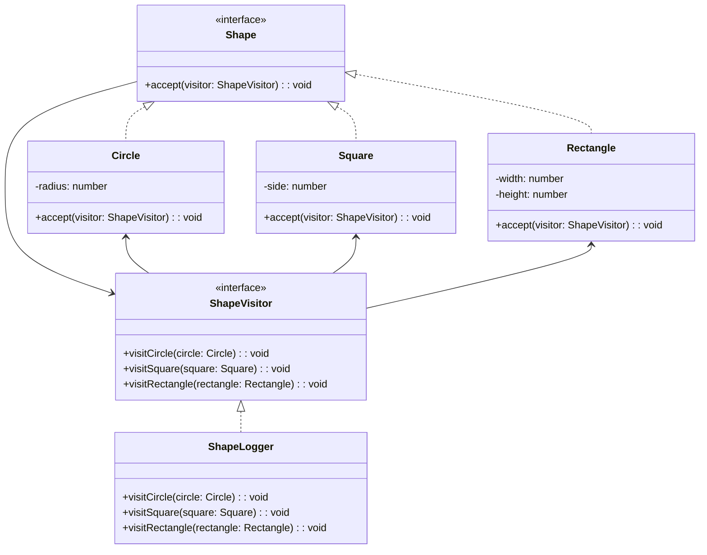

```mermaid
classDiagram
    class Shape {
        <<interface>>
        +accept(visitor: ShapeVisitor): void
    }
    class Circle {
        -radius: number
        +accept(visitor: ShapeVisitor): void
    }
    class Square {
        -side: number
        +accept(visitor: ShapeVisitor): void
    }
    class Rectangle {
        -width: number
        -height: number
        +accept(visitor: ShapeVisitor): void
    }
    class ShapeVisitor {
        <<interface>>
        +visitCircle(circle: Circle): void
        +visitSquare(square: Square): void
        +visitRectangle(rectangle: Rectangle): void
    }
    class ShapeLogger {
        +visitCircle(circle: Circle): void
        +visitSquare(square: Square): void
        +visitRectangle(rectangle: Rectangle): void
    }
    Shape --> ShapeVisitor
    Shape <|.. Circle
    Shape <|.. Square
    Shape <|.. Rectangle
    ShapeVisitor <|.. ShapeLogger
    Circle <-- ShapeVisitor
    Square <-- ShapeVisitor
    Rectangle <-- ShapeVisitor
```
